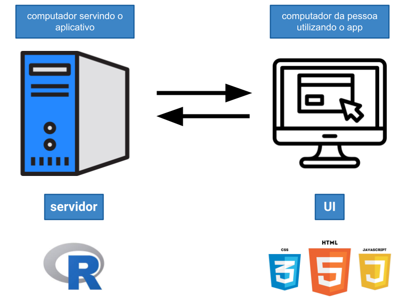

```{r, include=FALSE}
`%>%` <- magrittr::`%>%`
blue <- function(x) {
  glue::glue(
    '<span style="color:#6495ed; font-weight: bold;">{x}</span>'
  ) %>% 
    htmltools::HTML()
}

colorido <- function(x, cor = "#6495ed") {
  glue::glue(
    '<span style="color:{cor}; font-weight: bold;">{x}</span>'
  ) %>% 
    htmltools::HTML()
}

link <- function(href, ...) {
  htmltools::a(
    href = href,
    target = "_blank",
    ...
  )
}

options(width = 85)

knitr::opts_chunk$set(fig.align = "center")
```

## Sobre mim

<center>
<div class = "sobre-mim">
  <div style = "margin-bottom: 80px;">
    
    
    
  </div>
    <span>
      <i class="fab fa-twitter"></i>
      <a href = "https://twitter.com/wamorim_">@wamorim_</a>
    </span>
</div>
</center>

---
## Sobre a Curso-R

.pull-left[
```{r, echo = FALSE}
htmltools::h3("Livros")

link(
  href = "https://livro.curso-r.com/",
  htmltools::img(src = "img/hex-livro.png", width = "100px")
)

link(
  href = "https://curso-r.github.io/zen-do-r/index.html",
  htmltools::img(
    src = "img/zen-do-r.png",
    width = "100px",
    style = "margin-left: 20px;"
  )
)
```

<br>

```{r, echo = FALSE}
htmltools::h3("Blog")
link(
  href = "https://blog.curso-r.com/",
  htmltools::img(src = "img/blog.png", width = "400px")
)
```

]

.pull-right[
```{r, echo = FALSE}
htmltools::h3("Material dos cursos")
link(
  href = "https://github.com/curso-r",
  htmltools::img(src = "img/github.png", width = "230px")
)
```

<br>

```{r, echo = FALSE}
htmltools::h3("Lives")
link(
  href = "https://www.youtube.com/c/CursoR6",
  htmltools::img(src = "img/youtube.png", width = "200px")
)
```

]

<br>

.center[
### [www.curso-r.com](https://www.curso-r.com)
]

---
class: center, middle
## O que é o Shiny?

### `r blue("Shiny é um framework em linguagem R para a criação de aplicativos web.")`

<div style = "height: 60px">

--

**framework**: conceitos + ferramentas

--
<br>

**aplicativos web**: uma página na internet, uma aplicação, um código

---
class: center
## Conceito

#### Programar em HTML sem saber HTML

<br>
<br>

## Ferramentas


---
class: center, middle

## [Exemplo de Shiny app](https://cursodashboards.shinyapps.io/penguins-dispersao/)

---
## Componentes básicos

Um aplicativo Shiny tem dois componentes básicos: a **UI** e o **servidor**.

--

- **UI**: o que a pessoa que está usando o app vê.

```{r, echo = FALSE}
knitr::include_graphics("img/app_penguins_disp.png")
```

--

- **servidor**: o que está acontecendo por trás das cortinas, no servidor.

Precisamos apenas adaptar como esse código recebe informação da UI (*inputs*) e devolve os resultados (*outputs*).

---
class: center
## Juntando tudo...

```{r, echo = FALSE, out.width="90%"}

```

---
## Em resumo

-  Você pode usar o Shiny para construir sites, aplicativos e dashboards interativos, tudo na Web (ou em uma rede local).

- Você sempre vai precisar de um servidor para hospedar o seu aplicativo Shiny.

- Você faz tudo isso sem sair do R.

---

## Mas cuidado

#### Como em tudo na Estatística (e na vida), precisamos ter análise crítica.

Antes de começar a fazer um Shiny app, pensar

- Eu realmente preciso fazer um aplicativo? Um relatório ou uma apresentação não seria suficiente?


- Quem vai usar o app? Em qual nível eu quero comunicar os meus resultados?


- Como eu vou hospedar esse aplicativo? Quantas pessoas vão usar?

